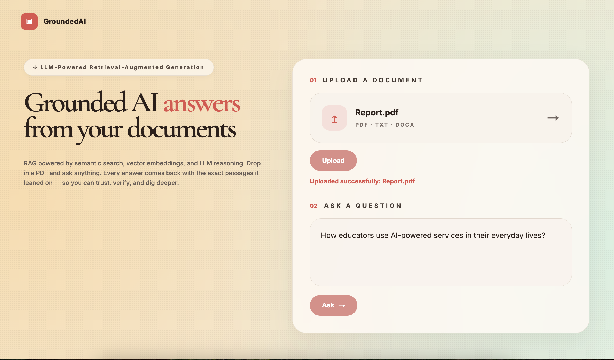
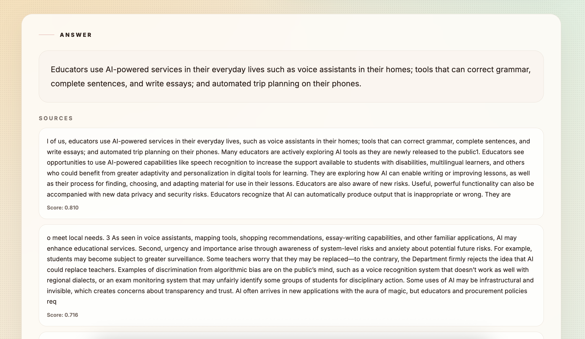

# GroundedAI

GroundedAI is a modern Retrieval-Augmented Generation (RAG) application that enables users to upload documents and receive grounded AI-generated answers using semantic search, vector embeddings, and LLM reasoning.

The system retrieves the most relevant document chunks from a vector database and generates context-aware responses backed by cited source passages.

---

## Features

- Upload PDF, DOCX, and TXT files
- AI-powered document question answering
- Semantic search using vector embeddings
- Retrieval-Augmented Generation (RAG)
- Grounded answers with cited context
- Modern React-based user interface
- FastAPI backend architecture
- Pinecone vector database integration
- Gemini API integration

---

## Screenshots

### Landing Page



---

### AI Generated Answer



---

## Tech Stack

### Frontend
- React
- Axios
- CSS

### Backend
- FastAPI
- Python

### AI & Vector Search
- Gemini API
- Pinecone Vector Database

---

## System Architecture

```text
User Uploads Document
        ↓
Text Extraction & Chunking
        ↓
Generate Embeddings (Gemini)
        ↓
Store Vectors in Pinecone
        ↓
User Asks Question
        ↓
Semantic Search in Pinecone
        ↓
Retrieve Relevant Chunks
        ↓
Generate Grounded Answer using Gemini
```

---

## Project Structure

```text
frontend/
backend/

backend/app/
├── api/
├── db/
├── services/
├── utils/
├── main.py
```

---

## Environment Variables

Create a `.env` file inside the `backend/` directory.

```env
PINECONE_API_KEY=your_pinecone_api_key
GEMINI_API_KEY=your_gemini_api_key
```

---

## Installation

### Backend Setup

```bash
cd backend

python3 -m venv venv
source venv/bin/activate

pip install -r requirements.txt

uvicorn app.main:app --reload
```

Backend runs on:

```text
http://127.0.0.1:8000
```

---

### Frontend Setup

```bash
cd frontend

npm install

npm run dev
```

Frontend runs on:

```text
http://localhost:5173
```

---

## API Endpoints

### Upload Document

```http
POST /api/upload
```

---

### Ask Question

```http
POST /api/query
```

Request Body:

```json
{
  "question": "What is this document about?",
  "doc_id": "document_id"
}
```

---

## Example Workflow

1. Upload a document
2. Document is chunked and converted into embeddings
3. Embeddings are stored in Pinecone
4. User asks a question
5. Relevant chunks are retrieved using semantic search
6. Gemini generates a grounded answer using retrieved context

---

## Future Improvements

- Multi-document querying
- Streaming AI responses
- Authentication & user accounts
- Chat history memory
- Source highlighting inside documents
- Cloud deployment

---

## Author

Navneet Kaur
